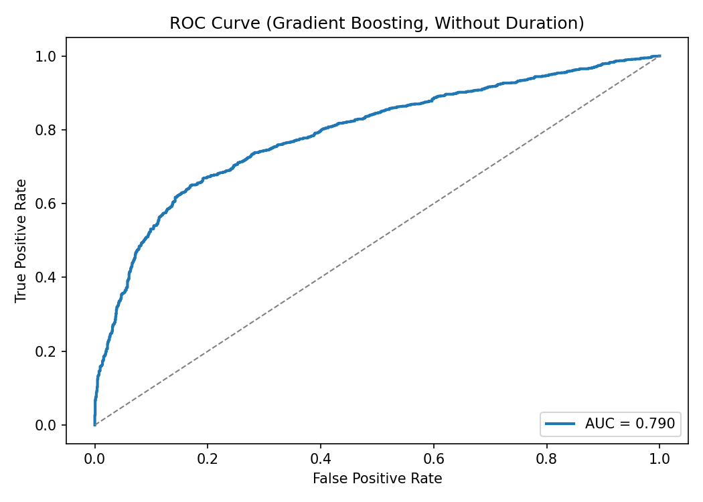
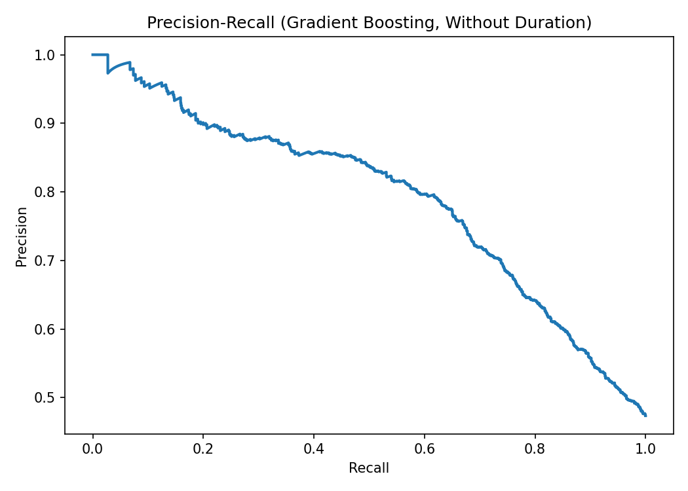
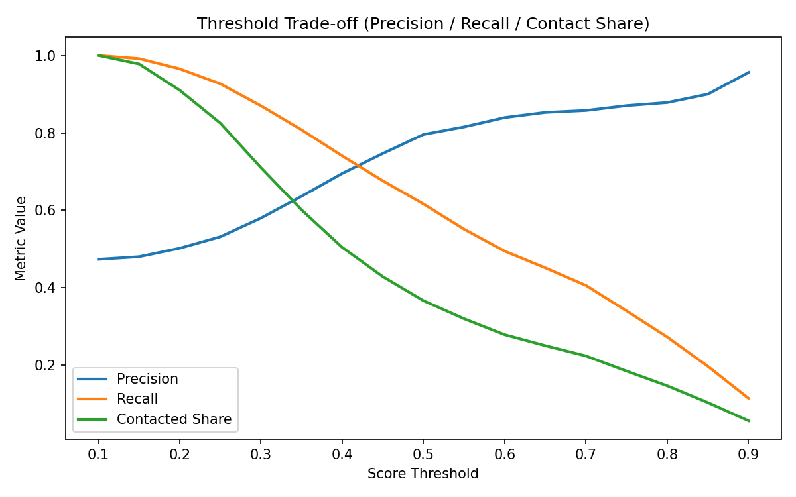
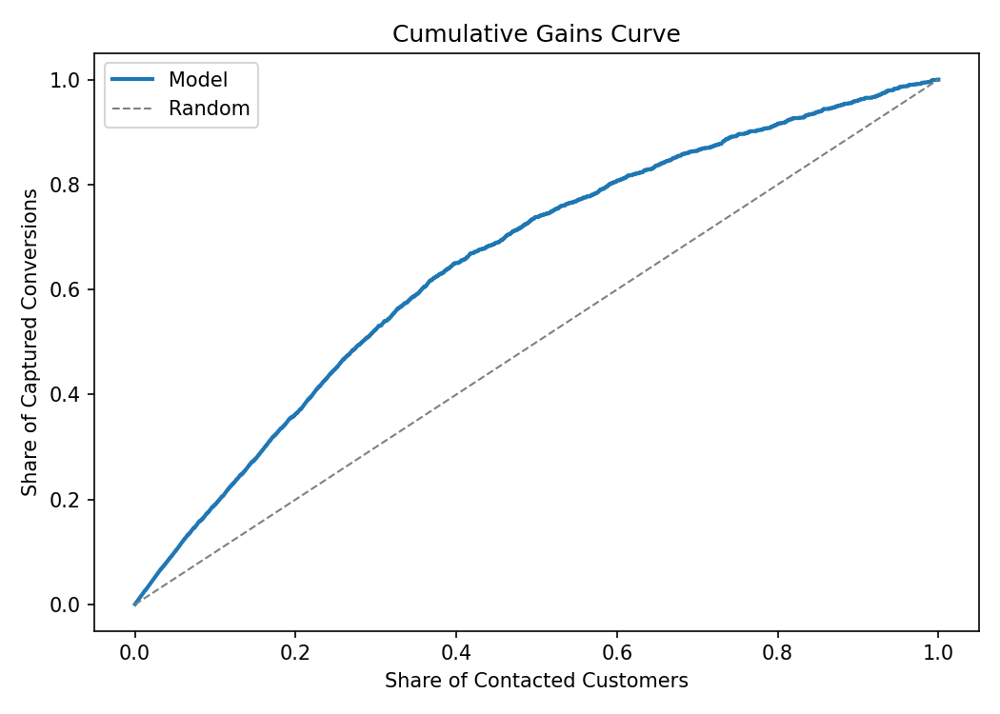
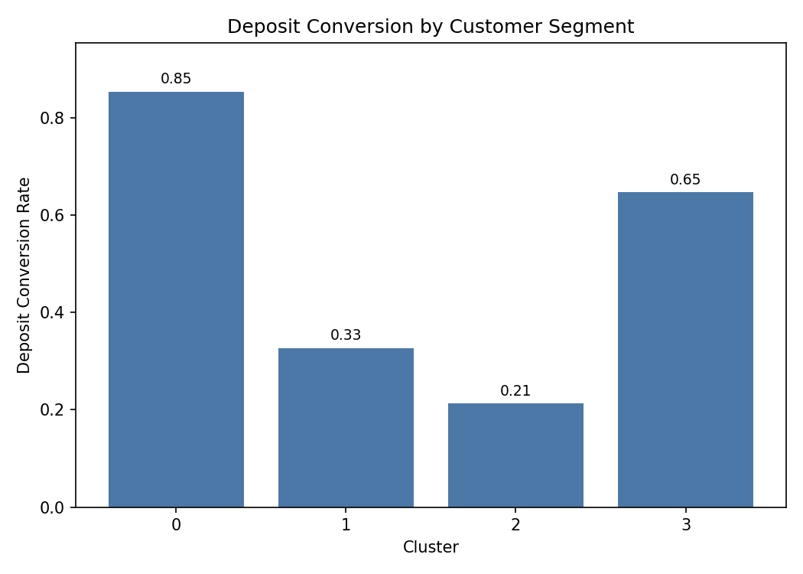

# Bank Marketing Targeting Decision System

## Executive Summary
This project frames bank telemarketing as a resource allocation problem: **who should be contacted under limited campaign capacity**. The workflow combines customer segmentation, supervised propensity modeling, leakage checks, targeting lift analysis, and an A/B test rollout plan. In offline evaluation, the best **deployable** model (without `duration`) is Gradient Boosting with ROC-AUC **0.790**, F1 **0.695**, precision **0.796**, and recall **0.616**. A leakage comparison shows why `duration` inflates scores (AUC **0.922** with `duration` vs **0.790** without it) but should not be used for production pre-contact scoring. Ranking quality is strong: the top 10% scored customers reach **90.0%** conversion (about **1.90x** baseline), and top 20% reaches **85.9%** conversion (about **1.81x** baseline). The project outputs threshold/top-K recommendations and a configurable business simulation to support campaign decision-making.

## Business Problem
Bank outbound campaigns have non-trivial cost (agent time, channel cost, customer fatigue risk). Contacting everyone is inefficient and can reduce ROI.

This project focuses on a practical decision question:
- Under budget and capacity constraints, which customers should be contacted first?
- What threshold/top-K rule should operations use?
- How can we validate the strategy with controlled experimentation?

Core decision system: **predictive targeting + customer segmentation + experiment design**.

## Business Objective
- Improve conversion efficiency, not only raw model metrics.
- Prioritize high-propensity customers when outreach capacity is limited.
- Prevent leakage-driven overestimation by separating descriptive vs deployable features.
- Produce testable deployment guidance through a randomized A/B test framework.

## Dataset
- Source: Kaggle `janiobachmann/bank-marketing-dataset`
- Size: 11,162 customer-campaign records
- Target: `deposit` (`yes`/`no`)

Important caveat:
- `duration` is a **post-contact** variable (call duration) and acts as leakage for pre-contact targeting. It is useful for retrospective analysis, but excluded from deployable scoring.

## Project Workflow / Methodology
1. **Data Preparation**
- Load dataset with fallback paths.
- Split numeric/categorical features.
- Build reusable preprocessing pipelines.

2. **EDA + Segmentation**
- Numeric/categorical response exploration.
- KMeans customer segmentation (with profile summaries).
- Segment-level conversion comparison for campaign planning.

3. **Supervised Modeling**
- Logistic Regression (interpretable baseline).
- Gradient Boosting (nonlinear benchmark).
- Train/test split with out-of-sample evaluation.

4. **Leakage Analysis**
- Evaluate with vs without `duration`.
- Mark deployable setting explicitly.

5. **Ranking / Lift Analysis**
- Top-K conversion and lift analysis (5/10/20/30/50%).
- Threshold metrics (precision, recall, contacted share).

6. **Business Decision Layer**
- Configurable simulation using `cost_per_contact` and `revenue_per_conversion`.
- Profit/net gain/ROI proxy by threshold and top-K strategy.
- Machine-generated targeting recommendation file.

7. **Experiment Design**
- A/B test plan (random targeting vs model-based targeting).
- KPI framework: conversion, CPA, ROI.

## Key Results
### 1) Deployable model performance
Best deployable setup (`without_duration`): **Gradient Boosting**
- ROC-AUC: **0.790**
- F1: **0.695**
- Precision: **0.796**
- Recall: **0.616**

### 2) Leakage conclusion (explicit)
- With `duration`: best ROC-AUC **0.922**
- Without `duration`: best ROC-AUC **0.790**

Interpretation: `duration` materially boosts offline metrics but is not a valid pre-contact feature for production targeting. The deployable benchmark is the **without-duration** setting.

### 3) Targeting lift
- Top 10% scored customers: conversion **90.0%**, lift **1.90x** baseline
- Top 20% scored customers: conversion **85.9%**, lift **1.81x** baseline

### 4) Segmentation insight
Four clusters show clear conversion spread (~21% to ~85%), and are summarized with actionable labels in `results/cluster_profile_actionable.csv`. Segmentation is used to **complement** model-based targeting with interpretable customer profiles.

### 5) Association rules (exploratory)
Rule mining is retained as exploratory pattern discovery. Under a moderate actionability filter (antecedent excludes `deposit_*`, consequent contains `deposit_yes`), the project yields **54** actionable-positive rules at current thresholds while keeping leakage control.

## Visual Outputs
### ROC Curve (Deployable Model)


### Precision-Recall Curve (Deployable Model)


### Threshold Trade-off (Precision / Recall / Contact Share)


### Cumulative Gains Curve


### Segment Conversion Comparison


## Business Recommendations
1. Use score-based prioritization under budget constraints.
- For constrained outreach, start with top-decile targeting and expand by budget tier.

2. Keep leakage-safe production scoring.
- Exclude `duration` from production propensity models.
- Use leakage-inclusive models only for retrospective analysis.

3. Combine propensity score + segment profile for campaign design.
- Use model ranking for who to contact.
- Use segment profile for message/channel strategy.

4. Deploy only through controlled experimentation.
- Validate incremental impact with randomized A/B test before full rollout.

## Repository Structure
- `src/data_utils.py`: data loading and preprocessing utilities
- `src/evaluate.py`: model building and evaluation helpers
- `src/business_metrics.py`: threshold/top-K/business simulation logic
- `src/plot_utils.py`: reusable plotting helpers
- `src/train.py`: supervised modeling + leakage + business decision outputs
- `src/segment_and_rules.py`: segmentation + exploratory rule mining outputs
- `results/`: committed result tables for quick review
- `results/figures/`: committed figures for README-level inspection
- `data/README.md`: dataset instructions and notes

## How to Run
### 1) Environment setup
```bash
python -m venv .venv
```

PowerShell:
```powershell
.\.venv\Scripts\Activate.ps1
```

macOS/Linux:
```bash
source .venv/bin/activate
```

Install dependencies:
```bash
pip install -r requirements.txt
```

### 2) Generate model + business outputs
```bash
python src/train.py
```

### 3) Generate segmentation + rule outputs
```bash
python src/segment_and_rules.py
```

Optional business assumptions for simulation:
PowerShell:
```powershell
$env:COST_PER_CONTACT=2.5
$env:REVENUE_PER_CONVERSION=100
python src/train.py
```

CMD:
```cmd
set COST_PER_CONTACT=2.5
set REVENUE_PER_CONVERSION=100
python src/train.py
```

## Result Files to Review First
- `results/model_metrics.csv`
- `results/leakage_summary.csv`
- `results/threshold_metrics.csv`
- `results/topk_metrics.csv`
- `results/business_simulation.csv`
- `results/targeting_recommendation.md`
- `results/cluster_profile_actionable.csv`

## Future Improvements
- Probability calibration for more reliable score-to-probability mapping.
- Profit-sensitive threshold optimization with explicit budget and capacity constraints.
- SHAP-based local/global explainability for stakeholder communication.
- Uplift modeling to estimate incremental treatment effect directly.
- Lightweight API or dashboard layer for campaign ops integration.

## Notes
- Business simulation outputs are scenario-based estimates under stated assumptions, not production outcomes.
- This repository is script-first for cleaner version control and easier reproducibility.
